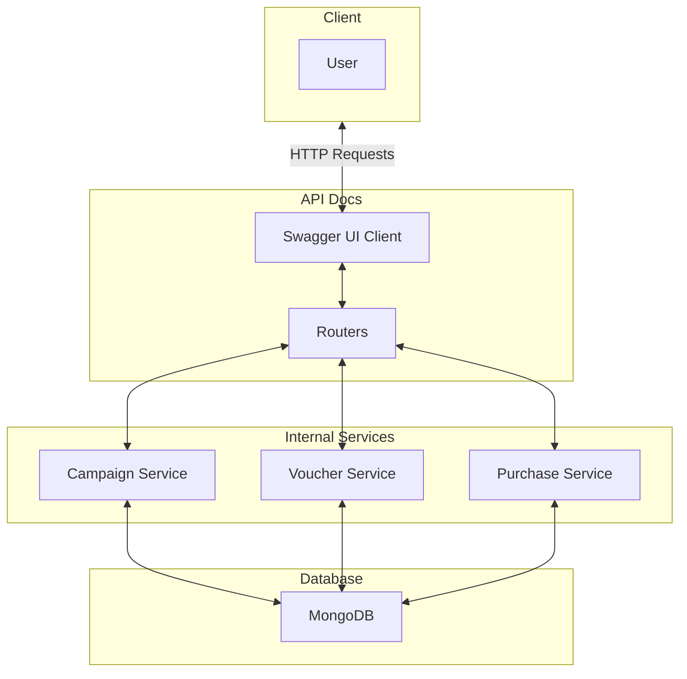

# Trinity App Architecture Diagram

Below is a professional architecture diagram of the Trinity App, illustrating the interaction between various components within the system.



## Database Schema

### Campaigns

| Field         | Type       | Description                                 |
| ------------- | ---------- | ------------------------------------------- |
| `_id`         | `string`   | Unique identifier for the campaign.         |
| `name`        | `string`   | Name of the campaign.                       |
| `discount`    | `float64`  | Discount percentage offered.                |
| `max_users`   | `int`      | Maximum number of users eligible.           |
| `used_users`  | `int`      | Number of users who have utilized vouchers. |
| `start_date`  | `datetime` | Campaign start date and time.               |
| `end_date`    | `datetime` | Campaign end date and time.                 |
| `description` | `string`   | Description of the campaign.                |

### Vouchers

| Field         | Type       | Description                                  |
| ------------- | ---------- | -------------------------------------------- |
| `_id`         | `string`   | Unique identifier for the voucher.           |
| `code`        | `string`   | Unique voucher code.                         |
| `campaign_id` | `string`   | Reference to the associated campaign.        |
| `user_id`     | `string`   | ID of the user who redeemed the voucher.     |
| `used`        | `bool`     | Indicates whether the voucher has been used. |
| `expiry_date` | `datetime` | Expiry date and time of the voucher.         |

### Purchases

| Field             | Type       | Description                               |
| ----------------- | ---------- | ----------------------------------------- |
| `_id`             | `string`   | Unique identifier for the purchase.       |
| `user_id`         | `string`   | ID of the user making the purchase.       |
| `subscription_id` | `string`   | Reference to the subscription plan.       |
| `amount`          | `float64`  | Original amount before discount.          |
| `discount`        | `float64`  | Discount applied to the purchase.         |
| `total`           | `float64`  | Total amount after applying the discount. |
| `voucher_code`    | `string`   | Voucher code applied (if any).            |
| `purchase_date`   | `datetime` | Date and time of the purchase.            |

### Subscriptions

| Field        | Type       | Description                               |
| ------------ | ---------- | ----------------------------------------- |
| `_id`        | `string`   | Unique identifier for the subscription.   |
| `plan`       | `string`   | Subscription plan name (e.g., silver).    |
| `user_id`    | `string`   | ID of the user who owns the subscription. |
| `start_date` | `datetime` | Subscription start date and time.         |
| `end_date`   | `datetime` | Subscription end date and time.           |
| `status`     | `string`   | Current status of the subscription.       |

### Users

| Field        | Type       | Description                     |
| ------------ | ---------- | ------------------------------- |
| `_id`        | `string`   | Unique identifier for the user. |
| `username`   | `string`   | Username of the user.           |
| `email`      | `string`   | Email address of the user.      |
| `password`   | `string`   | Hashed password of the user.    |
| `created_at` | `datetime` | Account creation date and time. |


# Trinity App API Endpoints

You can read the Makefile to see some supported commands. To easily start, just type `make run-all` the first time, or `make run`.

### Prerequisites

- **Go:** I used Go 1.22. You can download it from the [official website](https://golang.org/dl/).
- **Docker:** MongoDB container run on Docker is required. Install Docker from the [official website](https://www.docker.com/get-started).
- **Make:** Required for running make command. Install from the [official website](https://gnuwin32.sourceforge.net/packages/make.htm).


## Available Makefile Commands

- **`make run-all`**
  - Executes all necessary steps to set up and run the application, including building the project, generating Swagger documentation, and starting the server.
  
- **`make run`**
  - Runs the application directly without rebuilding or regenerating Swagger documentation.
  
- **`make build`**
  - Builds the application binary.
  
- **`make clean`**
  - Cleans up generated binaries.
  
- **`make swag`**
  - Installs Swagger (`swag`) and generates Swagger documentation.
  
- **`make help`**
  - Displays the help message with available Makefile commands.

## 1. Create Campaign

- **Method:** `POST`
- **URL:** `http://localhost:8080/campaigns/`
- **Description:** Creates a new promotional campaign.
- **Test URL:** [http://localhost:8080/campaigns/](http://localhost:8080/campaigns/)
- **Sample Request Body:**
    ```json
    {
        "name": "First Login Promotion",
        "discount": 30,
        "max_users": 100,
        "start_date": "2024-11-01T00:00:00Z",
        "end_date": "2024-12-31T23:59:59Z",
        "description": "30% off for the first 100 users."
    }
    ```

## 2. List Campaigns

- **Method:** `GET`
- **URL:** `http://localhost:8080/campaigns/`
- **Description:** Retrieves a list of all promotional campaigns.
- **Test URL:** [http://localhost:8080/campaigns/](http://localhost:8080/campaigns/)

## 3. Generate Vouchers

- **Method:** `POST`
- **URL:** `http://localhost:8080/campaigns/{campaign_id}/vouchers`
- **Description:** Generates a specified number of vouchers for a given campaign.
- **Test URL:** `http://localhost:8080/campaigns/67306ac967cb44b004051e92/vouchers`
- **Sample Request Body:**
    ```json
    {
        "count": 100
    }
    ```

## 4. Redeem Voucher

- **Method:** `POST`
- **URL:** `http://localhost:8080/vouchers/redeem`
- **Description:** Redeems a voucher using its code and the user's ID.
- **Test URL:** [http://localhost:8080/vouchers/redeem](http://localhost:8080/vouchers/redeem)
- **Sample Request Body:**
    ```json
    {
        "code": "VOUCHER123",
        "user_id": "user1"
    }
    ```

## 5. Process Purchase

- **Method:** `POST`
- **URL:** `http://localhost:8080/purchases`
- **Description:** Processes a subscription purchase with an optional voucher code.
- **Test URL:** [http://localhost:8080/purchases](http://localhost:8080/purchases)
- **Sample Request Body:**
    ```json
    {
        "user_id": "user1",
        "plan": "silver",
        "voucher_code": "VOUCHER123"
    }
    ```

## 6. Health Check

- **Method:** `GET`
- **URL:** `http://localhost:8080/health`
- **Description:** Checks the health status of the application.
- **Test URL:** [http://localhost:8080/health](http://localhost:8080/health)

## 7. Swagger Documentation

- **URL:** `http://localhost:8080/swagger/index.html`
- **Description:** Interactive API documentation and testing interface.
